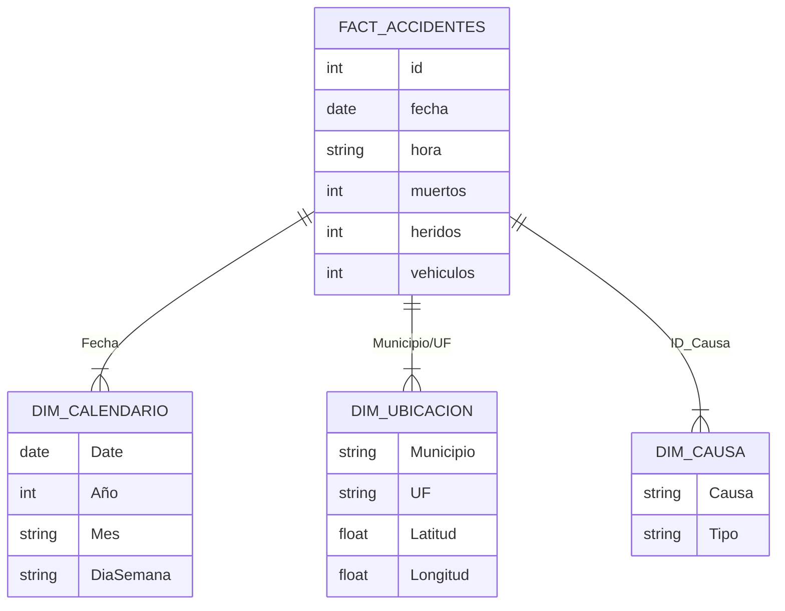

# 🚗 Análisis Estratégico de Accidentes de Tránsito


---

## 📑 Tabla de Contenido

1.  [Introducción y Objetivos](#-introducción-y-objetivos)
2.  [Diccionario de Datos](#-diccionario-de-datos)
3.  [Modelo de Datos (Estrella)](#-modelo-de-datos-estrella)
4.  [Ingeniería de Características (DAX)](#-ingeniería-de-características-dax)
    *   [Calendario Inteligente](#calendario-inteligente)
    *   [Medidas Fundamentales](#medidas-fundamentales)
    *   [Inteligencia de Tiempo](#inteligencia-de-tiempo)
5.  [Visualización Avanzada (HTML/CSS)](#-visualización-avanzada-htmlcss)
    *   [Tarjetas KPI Premium](#tarjetas-kpi-premium)
    *   [Grid de Detalle](#grid-de-detalle)
    *   [Brújula de Riesgo](#brújula-de-riesgo)
    *   [Heatmap Semanal](#heatmap-semanal)
6.  [Insights y Hallazgos](#-insights-y-hallazgos)
7.  [Conclusión](#-conclusión)

---

## 🎯 Introducción y Objetivos

Este proyecto tiene como finalidad transformar un dataset crudo de accidentes viales en un **sistema de inteligencia de negocios** capaz de salvar vidas mediante la identificación de patrones de riesgo.

Utilizando **Microsoft Power BI** y técnicas avanzadas de visualización con **HTML & CSS embebido en DAX**, se ha construido un dashboard que permite:

*   📍 **Geolocalizar** puntos negros de alta siniestralidad.
*   🕒 **Identificar** ventanas horarias críticas (horas pico y fines de semana).
*   🔍 **Analizar** las causas raíz (distracción, velocidad, clima).
*   📊 **Monitorear** KPIs de seguridad vial en tiempo real.

---

## 📁 Diccionario de Datos

El dataset origen `BD-Accidentes-Carreteras.xlsx` ha sido procesado y normalizado. A continuación, se detalla la estructura de la tabla de hechos principal.

| Campo | Tipo de Dato | Descripción Funcional | Ejemplo |
| :--- | :--- | :--- | :--- |
| `id` | Entero | Identificador único del siniestro. | `83451` |
| `fecha` | Fecha | Fecha exacta del accidente. | `2023-05-12` |
| `hora` | Hora | Hora del suceso. | `14:30:00` |
| `uf` | Texto | Unidad Federativa (Estado/Región). | `SP` |
| `municipio` | Texto | Ciudad donde ocurrió el evento. | `Campinas` |
| `causa_accidente` | Texto | Razón principal reportada por la autoridad. | `Falta de atención` |
| `tipo_accidente` | Texto | Clasificación del impacto. | `Colisión trasera` |
| `clasificación_accidente` | Texto | Gravedad del suceso (Con víctimas/Sin víctimas). | `Con Víctimas` |
| `sentido_vía` | Texto | Dirección del flujo vehicular. | `Creciente` |
| `tipo_pista` | Texto | Configuración de la carretera. | `Doble` |
| `personas` | Entero | Total de personas involucradas. | `4` |
| `muertos` | Entero | Cantidad de fallecidos en el lugar. | `1` |
| `heridos_leves` | Entero | Personas con lesiones menores. | `2` |
| `heridos_graves` | Entero | Personas con lesiones severas. | `0` |
| `ilesos` | Entero | Personas sin daños físicos. | `1` |
| `vehículos` | Entero | Cantidad de vehículos participantes. | `2` |
| `latitude` | Decimal | Coordenada geográfica (Latitud). | `-23.5505` |
| `longitude` | Decimal | Coordenada geográfica (Longitud). | `-46.6333` |

---

## 🧩 Modelo de Datos (Estrella)

Para garantizar un rendimiento óptimo en Power BI, se recomienda transformar la estructura plana en un modelo dimensional **Estrella (Star Schema)**.



---

## 🧮 Ingeniería de Características (DAX)

### Calendario Inteligente
Tabla calculada esencial para el análisis temporal (Time Intelligence).

```dax
Dim_Calendario = 
VAR FechaInicio = MIN('BD-Accidentes-Carreteras'[Fecha])
VAR FechaFin = MAX('BD-Accidentes-Carreteras'[Fecha])
RETURN
ADDCOLUMNS (
    CALENDAR (FechaInicio, FechaFin),
    "Año", YEAR([Date]),
    "Mes", FORMAT([Date], "MMMM"),
    "Mes Corto", FORMAT([Date], "MMM"),
    "Día Semana", FORMAT([Date], "dddd"),
    "Trimestre", "T" & QUARTER([Date]),
    "Año-Mes", FORMAT([Date], "YYYY-MM"),
    "Fin de Semana", IF(WEEKDAY([Date], 2) >= 6, "Sí", "No")
)
```

### Medidas Fundamentales

Estas medidas base sirven como ladrillos para cálculos más complejos.

*   **Total Accidentes:** `COUNT('BD-Accidentes-Carreteras'[id])`
*   **Total Fallecidos:** `SUM('BD-Accidentes-Carreteras'[Muertos])`
*   **Total Heridos:** `SUM('BD-Accidentes-Carreteras'[Heridos_leves]) + SUM('BD-Accidentes-Carreteras'[Heridos_graves])`
*   **Tasa de Letalidad (%):** `DIVIDE([Total Fallecidos], [Total Personas], 0)`

---

## 🎨 Visualización Avanzada (HTML/CSS)

Este proyecto se destaca por el uso del objeto visual **"HTML Content"**, permitiendo renderizar diseños web completos dentro de Power BI. Esto rompe las limitaciones de los gráficos nativos.

### 1. Tarjetas KPI Premium (`HTML_Banner_Premium_Slim`)
Crea un encabezado tipo "Dashboard Web" con tarjetas flotantes y sombras.

*   **Diseño:** Flexbox container.
*   **Estilo:** Sombras suaves (`box-shadow`), bordes redondeados (`border-radius`), y tipografía `Segoe UI`.
*   **Dinamismo:** Los valores de Accidentes, Fallecidos y Heridos se inyectan dinámicamente desde las medidas DAX.

### 2. Brújula de Riesgo (`HTML_Brujula_Riesgo`)
Una tarjeta de alerta que muestra automáticamente la causa #1 de accidentes.

*   **Lógica:** Utiliza `TOPN(1...)` para encontrar la causa más frecuente.
*   **Visual:** Muestra un icono de advertencia grande y transparente de fondo para dar contexto visual inmediato.
*   **Insight:** Incluye un texto dinámico recomendando acciones (ej: "Reforzar patrullaje").

### 3. Heatmap Semanal (`HTML_Heatmap_Dias_V3`)
Un monitor de intensidad que muestra los días de la semana coloreados según la frecuencia de accidentes.

*   **Técnica:** Calcula la opacidad del color rojo (`rgba(231, 76, 60, Opacidad)`) basándose en el % del máximo valor semanal.
*   **Emojis:** Asigna emojis (🚨, ⚠️, ✅) automáticamente según el nivel de riesgo del día.
*   **Estructura:** Itera sobre una tabla virtual de 7 días usando `CONCATENATEX` para generar los 7 bloques `div`.

### 4. Ranking Top 10 Causas (`HTML_Tabla_Top10_Causas`)
Una tabla HTML estilizada que supera a la tabla nativa de Power BI en diseño.

*   **Barras de Datos:** Dibuja barras de progreso HTML/CSS dentro de la celda para visualizar el volumen de siniestros.
*   **Alertas:** Colorea el número de fallecidos en rojo si supera un umbral crítico.

---

## 🧠 Insights y Hallazgos

Tras el análisis de los datos, se han detectado los siguientes patrones clave:

1.  **Factor Humano:** La "Falta de atención del conductor" es consistentemente la causa #1 de siniestros, sugiriendo la necesidad de campañas contra el uso del celular.
2.  **Puntos Ciegos:** Las colisiones traseras representan un alto volumen, indicando problemas de distancia de seguridad o frenado brusco.
3.  **Horarios Críticos:** Se observa un repunte significativo de accidentes graves durante los fines de semana y en horas nocturnas (posible correlación con fatiga o alcohol).
4.  **Zonas Urbanas:** Aunque las autopistas tienen accidentes más veloces, la mayor densidad de incidentes ocurre en perímetros urbanos/municipales.

---

## ✅ Conclusión

Este documento sirve como guía técnica y funcional para el mantenimiento y evolución del **Tablero de Control de Accidentes**. La combinación de un modelo de datos robusto con visualizaciones de alto impacto visual permite a las autoridades pasar de la **reacción** a la **prevención**.

---
**Generado por:** Asistente de Ingeniería Gemini | **Fecha:** Enero 2026
